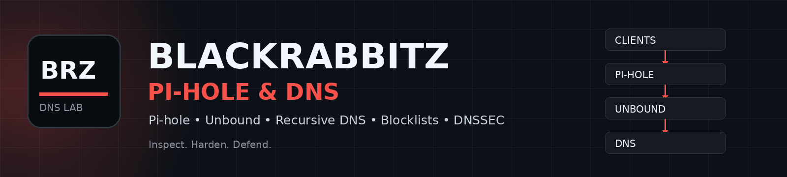

<p align="center">
  
</p>

<h1 align="center">🛡️ Pi-hole & DNS</h1>

<p align="center">
  <strong>DNS Filtering • Recursive DNS • Blocklists • Self-Hosted Privacy</strong>
</p>

<p align="center">
  
  
  
  
</p>

---

## 📌 Über diesen Bereich

Hier findest du meine Projekte rund um **Pi-hole, Unbound, DNS-Filtering, DNS-Security und DNS-Blocklisten**.

Der Schwerpunkt liegt auf selbst gehosteten DNS-Lösungen, rekursiver Namensauflösung und dem Blockieren von Werbung, Tracking, Telemetrie und bekannten schädlichen Domains auf DNS-Ebene.

---

## 📦 Projekte

| Projekt | Beschreibung | Schwerpunkt |
|---|---|---|
| [**PiHole-Unbound-Docker**](https://github.com/BlackRabbitZ/PiHole-Unbound-Docker) | Pi-hole + Unbound als Docker-Stack | Docker • Pi-hole • Unbound • DNSSEC |
| [**DietPi + Pi-hole + Unbound**](https://github.com/BlackRabbitZ/dietpi-pihole-unbound) | Installation und Konfiguration auf DietPi / Raspberry Pi | Raspberry Pi • DietPi • Hardening |
| [**BlackRabbitZ DNS Blocklists**](https://github.com/BlackRabbitZ/BlackRabbitZ-DNS-Blocklists) | Automatisch gepflegte DNS-Blocklisten | Ads • Tracking • Telemetrie • Security |

---

## 🐳 PiHole-Unbound-Docker

**Pi-hole + Unbound als eigener Docker-DNS-Stack.**

Das Projekt kombiniert Pi-hole als DNS-Filter mit Unbound als rekursivem Resolver.

### Enthalten

- Pi-hole
- Unbound
- Docker Compose
- DNSSEC
- Healthchecks
- Backups
- DNS-Hardening

➡️ **[Zum Repository](https://github.com/BlackRabbitZ/PiHole-Unbound-Docker)**

---

## 🥧 DietPi + Pi-hole + Unbound

**Pi-hole und Unbound direkt auf DietPi bzw. Raspberry Pi.**

Das Projekt richtet sich an Nutzer, die ihren DNS-Stack ohne Docker direkt auf einem Raspberry Pi betreiben möchten.

### Enthalten

- DietPi
- Raspberry Pi
- Pi-hole
- Unbound
- DNSSEC
- Installation
- Konfiguration
- Hardening

➡️ **[Zum Repository](https://github.com/BlackRabbitZ/dietpi-pihole-unbound)**

---

## 🚫 BlackRabbitZ DNS Blocklists

**DNS-Blocklisten für Pi-hole und kompatible DNS-Filter.**

Die Listen dienen dazu, unerwünschte Domains bereits auf DNS-Ebene zu blockieren.

### Kategorien

- 📢 Werbung
- 👁️ Tracking
- 📊 Telemetrie
- 📱 Mobile Tracking
- 🎮 Gaming-Telemetrie
- 🦠 Malware
- 🎣 Phishing
- 🔐 Security
- 👨‍👩‍👧 Family

➡️ **[Zum Repository](https://github.com/BlackRabbitZ/BlackRabbitZ-DNS-Blocklists)**

---

## 🏗️ Typische Architektur

```text
Clients
   │
   ▼
Pi-hole
   │
   ▼
Unbound
   │
   ▼
Root / Authoritative DNS
```

**Pi-hole** übernimmt die Filterung. **Unbound** führt die rekursive DNS-Auflösung durch.

---

## 🧭 Welches Projekt passt zu mir?

| Du möchtest ... | Passendes Projekt |
|---|---|
| Pi-hole + Unbound mit Docker betreiben | **PiHole-Unbound-Docker** |
| Pi-hole + Unbound direkt auf Raspberry Pi / DietPi betreiben | **DietPi + Pi-hole + Unbound** |
| zusätzliche DNS-Blocklisten verwenden | **BlackRabbitZ DNS Blocklists** |
| einen eigenen rekursiven Resolver verwenden | **Unbound-Projekte** |
| Werbung, Tracking und Telemetrie DNS-basiert blockieren | **DNS Blocklists** |

---

<p align="center">
  <strong>BlackRabbitZ</strong><br>
  Ethical Hacking • System Hardening • Privacy • Defensive Security
</p>

<p align="center">
  <a href="https://github.com/BlackRabbitZ">GitHub Profil</a>
</p>
